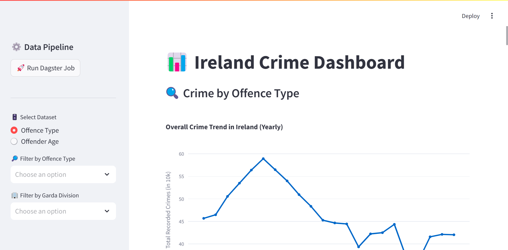

# 📊 Ireland Crime Detection Dashboard

An interactive data dashboard built with Streamlit for exploring and analyzing crime statistics in Ireland. It offers interactive visualizations based on offence types and the age distribution of suspected offenders. The data pipeline is powered by Dagster, automating the ETL (Extract, Transform, Load) workflow for consistent and up-to-date data delivery.

The system ingests data from official APIs using the JSON-STAT standard and processes it through a Dagster-powered ETL pipeline. MongoDB is used for intermediate storage and transformation, while PostgreSQL serves as the queryable backend for the dashboard. Final visualizations are rendered through Plotly and served interactively using Streamlit.

## 📁 Project Structure

```bash
crimedetection-AYS/
├── dashboard/              # Streamlit dashboard app
│   └── dashboard.py        # Main Streamlit app
├── data_pipeline/          # Dagster data pipeline code
│   ├── project_master.py   # Combined Dagster pipeline job
│   ├── dagster_pipe.py     # Individual Dagster pipeline job
│   ├── repository.py       # Repository Definition 
│   └── visualizations.py   # All chart functions used in the dashboard
├── config.py               # Database config (e.g., PostgreSQL engine,MongoDB)
├── requirements.txt        # Python dependencies
├── README.md               # Project documentation
└── .venv/                  # Virtual environment (to be created by user)
└── workspace.yaml          # Connects Dagster to pipeline code.
```

## 🚀 Features

- 📈 Interactive visualizations using Plotly and Streamlit
- 🧠 Dagster integration for data pipeline execution
- 🗃️ Filter by offence type, age group, Garda division, and more
- 📊 Line charts, bar charts, heatmaps, area charts, and animations
- ⚙️ Clean sidebar controls for dataset selection and job status

## 📂 Data Source

This project uses the following datasets provided by Ireland's Central Statistics Office via data.gov.ie:

- [Dataset 1: Recorded Crime Incidents (CJQ06)](https://data.gov.ie/dataset/cjq06-recorded-crime-incidents) – Contains statistics on recorded crime incidents by Garda division and offence type.
- [Dataset 2: Detected Recorded Crime by Age of Suspected Offenders (RCD09)](https://data.gov.ie/dataset/rcd09-detected-recorded-crime-by-age-of-suspected-offenders) – Provides breakdowns of detected crimes by the age group of suspected offenders.

These datasets are periodically retrieved and processed via a Dagster pipeline to support the visualizations shown in the dashboard.


## 🛠️ Installation

### Clone the repository
```bash
git clone https://github.com/<your-username>/crimedetection-AYS.git
cd crimedetection-AYS
```

### Create a virtual environment (Python 3.12)

```bash
# Create virtual environment using Python 3.12
python -m venv .venv
```

### Activate the virtual environment

#### On macOS/Linux:
```bash
source .venv/bin/activate
```

#### On Windows:
```bash
.venv\Scripts\activate
```

### Install dependencies
```bash
pip install -r requirements.txt
```
## 🧰 Configuration


Create a file `config.py` and ensure your file contains the correct PostgreSQL database configuration and MongoDB configuration :

```python
from pymongo import MongoClient
from sqlalchemy import create_engine

# MongoDB connection 
MONGO_URI = <your-mongoDB-connection-string> 
mongo_client = MongoClient(MONGO_URI)
mongo_db = mongo_client[<your-database-name>]


# PostgreSQL connection string
PG_CONN_STRING = "postgresql://<your-db-user-name>:<your-db-password>@localhost:5432/<your-database-name>"
pg_engine = create_engine(PG_CONN_STRING)
```

## 🧪 Running the App

### 1. Start the Streamlit Dashboard
```bash
streamlit run .\dashboard\dashboard.py
```

### 2. Run the Dagster Pipeline (manually or via button in UI)
#### To run the pipeline manually:
```bash
dagster job execute -f data_pipeline/project_master.py -j combined_pipeline_job
```
Alternatively, click the "🚀 Run Dagster Job" button from the sidebar in the dashboard to trigger it.

#### To run the pipeline from Dagster UI:
Start the processor on one terminal.
```bash
dagster-daemon run
```
On the other terminal , start the Dagster UI using this command:
```bash
dagster-webserver
```

## 🧩 Technologies Used

- **Python**
- **Streamlit**
- **Plotly**
- **Dagster**
- **PostgreSQL**
- **MongoDB**
- **pandas**


## 📸 Screenshots

<p align="center">
  
</p>


## 📜 License

This project is licensed under the [Creative Commons Attribution 4.0 International License (CC BY 4.0)](https://creativecommons.org/licenses/by/4.0/).


## 🙋‍♂️ Author

- **Joseph J.** – [GitHub Profile](https://github.com/JosephJ7)


## 📬 Contact

For feedback, issues, or suggestions:  
📧 josephjacobie2001@gmail.com  
📁 Or create an [issue](https://github.com/JosephJ7/crimedetection-AYS/issues)

